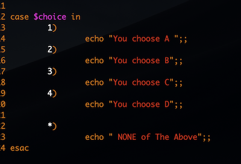

# Bash Grammer

<div style="text-align: right">システム開発第2部１グループ</div>

<div style="text-align: right">ユダフン</div>

## Variable (変数)

`変数名=値`

- 変数を使う際は、いろいろ方法があります。
- `${変数名}`
- 変数に代入する際はスペースは入れない。

## Source

`source ファイル名`

- シェルの中で他のシェルファイルを読み込む

## If

```bash
if [条件式]；then
 	~~~
elif [条件式]；then
	~~~
else
	~~~
fi
 
```

- `-eq` equal `[ A -eq B ]`
- `-ne`  not equal
- `-gt`  greater then
- `-lt`  less then
- `-ge`  greater or equal then
- `-le`  less or equal then


## Case



## For

```bash
for 変数　in 条件；
do
	~~~
done
```

- 数字で直接指定する場合

  `for i in {0..6}`
  
- フォルダーのファイル個数分繰り返す場合

  `for i in ls /test/~~`

  `for i in /test/~~/*`


## while

```bash
while [　条件式　]；
do
	~~~
done
```

- while文はwhileの中で、終了条件が存在する必要がある。


## Exit

```bash
echo "line1"
echo "line2"
echo "line3"
exit
echo "line４"
```

5行目の`echo` は実行されない。

### Function

```bash
hello2() {
	echo "hello $1"
	echo "hello $2"
}
```

- $1, 2はパラメーターとして渡されるデータ。渡される際の順番