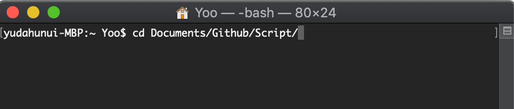

# Linux Command Cheat Sheet

## Terminal Overview

`Teraterm`を使ってやってみます。

`Teraterm`とは？

>**他のコンピュータに接続して操作するときに使うソフトである**
>　**↓**
>**他のコンピュータの端末として動くソフトである**
>　**↓**
>**すなわちターミナルエミュレータである**

---

### cd, Change Directory

`cd FilePath`

- フォルダを移動するためのコマンド。
- フォルダのパスに`..`を入れると現在のフォルダの上の階層のフォルダに移動。
- ルートに戻るためには　`FilePath`を入力しなくてもいい

---

### pwd, Present Working Directory

`pwd`

- 現在、ユーザーがいるパスを表示（作業している階層・パス）

---

### ls, List

`ls [option]`

- ファイルやフォルダのリストを表示します。
- `-l` ファイルやフォルダの詳細まで表示する
- `-la ` 隠されたファイルやフォルダまで表示する。

---

### Touch

`touch [option] filename1 [filename2] ...`

ファイルを生成。

- 一つに行に複数のファイルを作成可能。
- `-c` 現在時間にファイルの時間情報を修正
- `-t YYYYMMDDhhmm` ファイルの時間情報を指定して変更

---

### mkdir, Make Directory

`mkdir [option] foldername`

- フォルダを作成

- `-m` 権限指定

---

### mv, Move

`mv [option] filename path(filename)`

- ファイルを他のフォルダに移動させたり、ファイル名を変更する。
- `-b` 移動先に同じ名前のファイルやフォルダが存在すれば、バックアップを作った後、移動させる。
- `-f`移動先に同じ名前のファイルが存在すれば、すぐ上書きする。
- `-i` 移動先に同じ名前のファイルが存在すれば、上書きをするかどうかユーザーに確認する。

---

### cp, Copy

`cp [option] filename path(filename)`

- ファイルを指定したパスにコピーする。（もしくは指定したファイル名にコピーして作成する）
- `-P` コピー対象ファイルを指定した際、パスまで指定したら、そのパス全体をコピーする。
- `-r` コピー対象がフォルダなら、フォルダ全体をコピーする。
- `-R` コピー対象がフォルダなら、そのフォルダに中のフォルダやファイルまでコピーする。

---

### rm, Remove

`rm [option] filname(path)`

- 指定したファイルやフォルダを削除する。

---

### cat, Concatenate,  *catenate*

`cat [option] filename [filename2] ...`

- ファイルの中身を出力します。
- `>` や`>>`を使って、別ファイルに上書きしたり、追記したりも可能
- ファイル名を複数入力すると、複数のファイルの内容が表示されます。
- `-n` ファイルの内容を行番号をつけて出力する。

---

### tail

`tail [option] filename`

- ファイルの最後の内容を表示する。（基本10行）
- `-f` ファイル内容に変更あれば、リアルタイムで表示
- `-n number` 指定した行数の内容を出力する。
- `-n +number`指定した行の以降の内容を出力。

---

### head

`head [option] filename`

- tail(尻尾)の反対。

---

### find

`find folder(path) [option] filename`

- あるファイルを検索するために使う。
- `-name` 大文字・小文字を区分して検索
- `-iname` 大文字・小文字区分せずに検索
- `-type [f][d]` ファイルやフォルダを出力
- `filename`に`"*.txt"`などの拡張子を持っている全てのファイルを指定して検索可能。
- `|(pipe)` と`xargs`、`grep` を組み合わせて応用できる。

---

### grep

`grep [option] pattern filename`

- ファイルの内容を検索
- `-i` 大文字・小文字を区分しない
- `-v pattern` 指定したパタン以外の結果を表示する。
- `-n` 行番号表示
- `|(pipe)`を組み合わせて応用できる。

---

### chmod, Change Mode

`chmod option permission filename`

- ファイルやフォルダの権限を変更する。
- `+-r` read権限を付与・削除する
- `+-w` write権限を付与・削除する。
- `+-x` execute権限を付与・削除する。
- `-c` 権限変更されたファイルの内容を出力する。
- ８進数変更
  - `ls -l ` を実行した際、ファイルの権限を確認できる。
    - 1番目の文字：ファイルのタイプ（`Directory`, `-`など)
    - 2番目から３文字：user 権限
    - 中３文字：group権限
    - 最後３文字：other権限
    - `read`=4, `write`=2, `execute`=1で指定可能。
- `chgrp`, `chown`

---

### awk

`awk '{print } filename'`

- あるデータを表示する（行列、２次元配列）

- `-F` 区切り文字指定

  

---

### vim

`vi(vim) filename`

- Terminal環境で使うText Editor

- 命令モード

  - `h` ：左に１スペース移動

  - `l`：右に１スペース移動

  - `j`：下の行に移動

  - `k`：上の行に移動

  - `u` ：アクションキャンセル（ctrl+zの機能）

  - `:w` ：作業内容保存

  - `:wq`：作業内容保存後終了

  - `:q!` ：保存せずに終了（強制終了）

  - `:q`：終了（変更履歴があれば、エラー発生）

    

- `i` 入力モードに切り替え

- `esc`で入力モードから命令モードに切り替え

---

参考資料

https://www.sejuku.net/blog/5465

https://www.cheatography.com/davechild/cheat-sheets/linux-command-line/

https://www.geeksforgeeks.org/linux-commands/

[http://www.redout.net/data/command.html](http://www.redout.net/data/command.html)

<h2>以上</h2>

